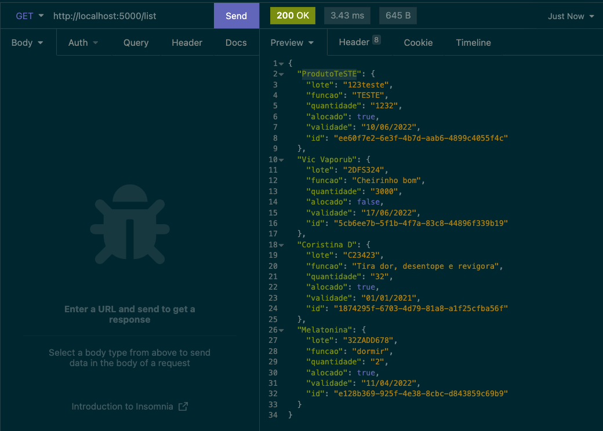
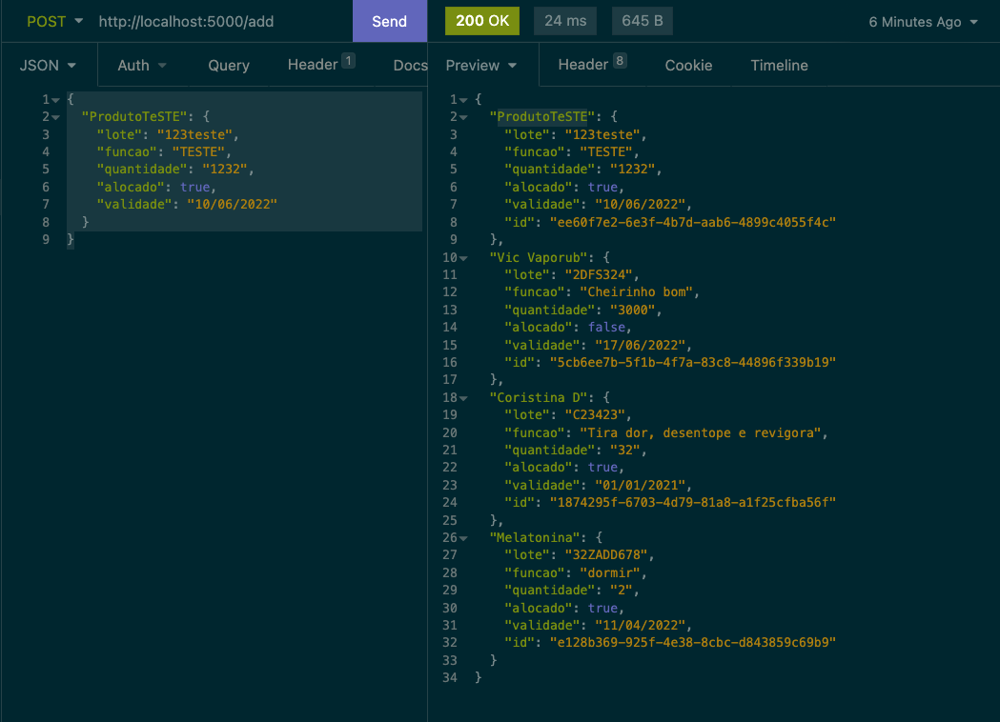
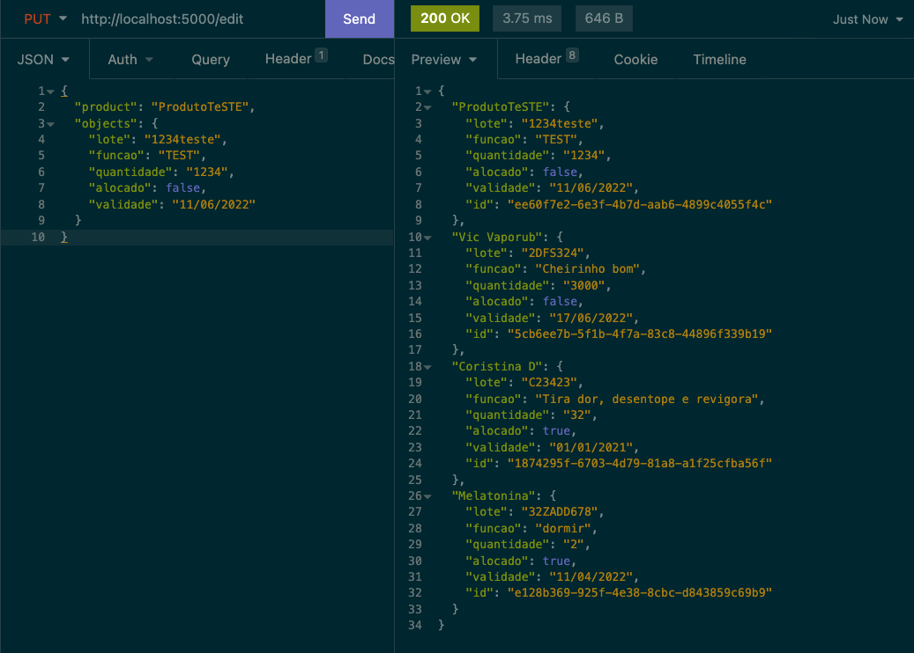
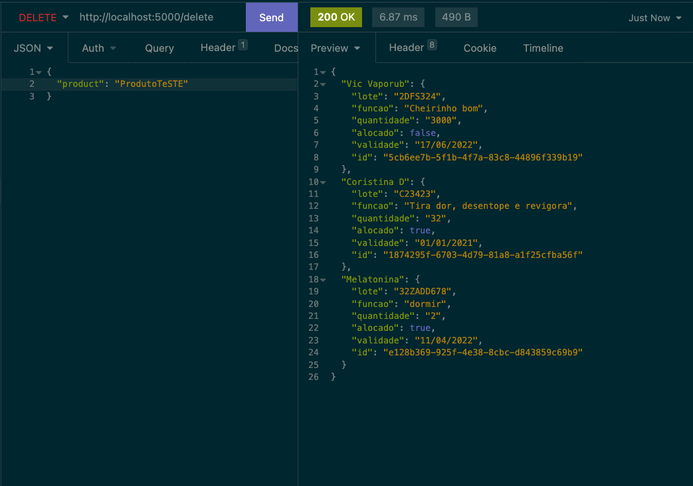
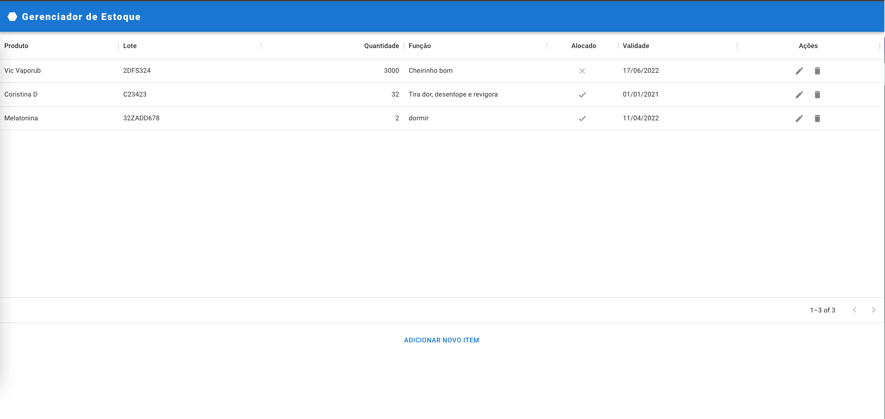

# CRUD Web

Nesta demo feita para a disciplina de Usabilidade, desenvolvimento web, mobile e jogos da Universidade Anhembi Morumbi fizemos um simples CRUD com UIs Web e Mobile.

# CRUD

Backend/API construído em [NodeJS](https://nodejs.org/en/) com framework [Express](https://expressjs.com/pt-br/).
Para iniciá-lo é necessário clonar o repositório e na raiz digitar os seguintes comandos no seu terminal:

`npm i` e então,
`npm run dev` ou `npm start`

Assim ele será instalado e iniciado na porta `5000` de seu `http://localhost`
Temos 5 rotas:

1.  List:
    Request do tipo Get localizada em: http://localhost:5000/list

    Enviar com body vazio, resposta semelhante à seguinte:
    

2.  Add:
    Request do tipo Post localizada em: http://localhost:5000/add

    Enviar com body do tipo JSON com os seguintes campos:

    ` { "ProdutoTeSTE": { "lote": "123teste", "funcao": "TESTE", "quantidade": "1232", "alocado": true, "validade": "10/06/2022" } }`

    Resposta semelhante à seguinte:
    

3.  Edit:
    Request do tipo Put localizada em: http://localhost:5000/edit

    Enviar com body do tipo JSON com os seguintes campos:

    `{ "product": "ProdutoTeSTE", "objects": { "lote": "1234teste", "funcao": "TEST", "quantidade": "1234", "alocado": false, "validade": "11/06/2022" } }`

    Resposta semelhante à seguinte:
    

4.  Delete:
    Request do tipo Delete localizada em: http://localhost:5000/delete

    Enviar com body do tipo JSON com os seguintes campos:

    `{ "product": "ProdutoTeSTE" }`

    Resposta semelhante à seguinte:
    

## Web

Frontend/UI construído em [React](https://pt-br.reactjs.org/) utilizando [NodeJS](https://nodejs.org/en/) como linguagem.

Para iniciá-lo é necessário ir até a pasta web neste que você clonou e executar os seguintes comandos no seu terminal:

`npm i` e então,
`npm start`

Assim seu frontend será iniciado na url: http://localhost:3000/

A tela vista será a seguinte:

Nela você pode editar, deletar e criar novos produtos como a interface indica.